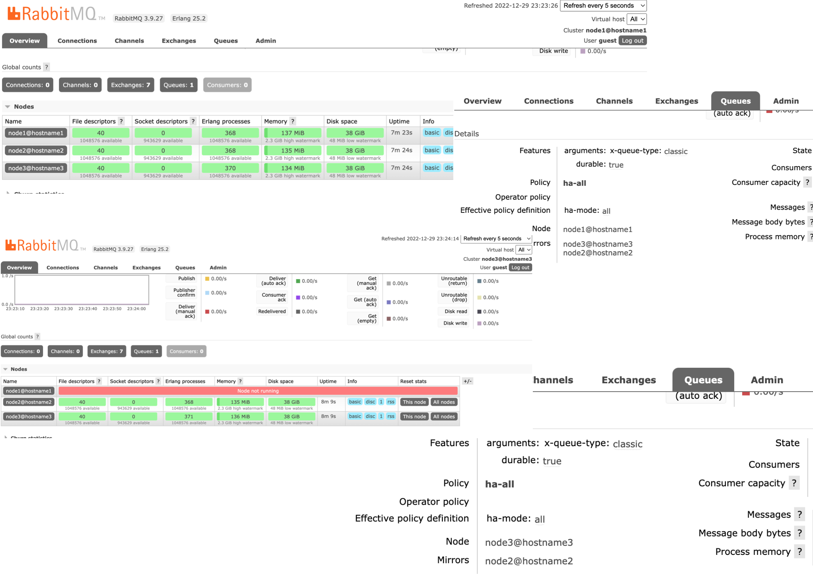

# RabbitMQ Clustering with Mirroring(Replication) - High Availability

_rabbitmq [3.9] | choose higher version if you like_

## rabbitmq on cluster - these setups help

1. RabbitMQ Installation [skip if already installed]
2. Hostname Resolution [or we can skip this by IP address]
3. RabbitMQ Configuration
4. RabbitMQ Clustering
5. RabbitMQ Mirroring



### 1. RabbitMQ Installation

---

_Here we are refering the linux machine to install rabbitmq. To install [refer here](https://www.rabbitmq.com/install-rpm.html) or below command on terminal to install_

```
cd /tmp
wget https://github.com/rabbitmq/erlang-rpm/releases/download/v24.1.7/erlang-24.1.7-1.el8.x86_64.rpm
wget https://github.com/rabbitmq/rabbitmq-server/releases/download/v3.9.11/rabbitmq-server-3.9.11-1.el8.noarch.rpm
rpm -Uvh erlang-24.1.7-1.el8.x86_64.rpm
rpm -Uvh rabbitmq-server-3.9.11-1.el8.noarch.rpm
```

_if linux machine has firewall service running, we need to enable rabbitmq ports by running below command_

```
firewall-cmd --permanent --add-port={5672,15672,4369,25672,35672}/tcp
firewall-cmd --reload
```

_now, let's run rabbitmq as a service on linux, and verify the service status_

```
systemctl enable rabbitmq-server
systemctl start rabbitmq-server
systemctl status rabbitmq-server
```

_**REPEAT** the step in Each & Every machine_

### 2. Hostname Resolution

---

_We are setting up rabbitmq with 3 linux machine, here we are the ips and their hostname reference as, modify as per your structure_

_Now, let's add hosts as known host for the machine, login to hostname1 machine and run the below command_

```
cat >> /etc/hosts <<EOF
192.168.1.101 hostname1
192.168.1.102 hostname2
192.168.1.103 hostname3
EOF

cat /etc/hosts
```

_**REPEAT** the step 3 in Each & Every machine_

### 3. RabbitMQ Configuration

_To run rabbitmq on cluster mode, we need set below os environment variables properly_

- RABBITMQ_NODENAME=rabbit
- RABBITMQ_USE_LONGNAME=true
- RABBITMQ_CONFIG_FILE=/etc/rabbitmq/rabbitmq.conf

_Or else you can use [rabbitmq-env.conf](https://www.rabbitmq.com/configure.html#customise-environment) to set up these variables as_

_[linux]: /etc/rabbitmq/rabbitmq-env.conf_

```
NODENAME=rabbit
USE_LONGNAME=true
CONFIG_FILE=/etc/rabbitmq/rabbitmq.conf
```

_**REPEAT** the step in Each & Every machine_

### 4. RabbitMQ Clustering

---

#### 4.1. Clustering configuration

_Here, we are setting up rabbitmq with [clustering](https://www.rabbitmq.com/clustering.html), to start the clustering mode, we need to setup erlang.cookie file_

_[linux]: /var/lib/rabbitmq/.erlang.cookie_

```
ADD_YOUR_SECRET_HERE
```

_modify the below parameters in rabbitmq.conf file, and restart the rabbitmq service_

_[linux]: /etc/rabbitmq/rabbitmq.conf_

```
loopback_users.guest = false
listeners.tcp.default = 5672

cluster_formation.peer_discovery_backend = classic_config
cluster_formation.classic_config.nodes.1 = rabbit@hostname1
cluster_formation.classic_config.nodes.2 = rabbit@hostname2
cluster_formation.classic_config.nodes.3 = rabbit@hostname3
```

_now, restart the service by running_

```
systemctl restart rabbitmq-server
```

_**REPEAT** the step 4.1 in Each & Every machine_

#### 4.2. Initializing the Cluster ONCE

_To initiate the clustering mode in rabbitmq once, we need to perform below steps **ONLY in one of rabbitmq**_

_Here, we are choosing rabbit@hostname1 cluster to add other nodes_

_Login to hostname2, need to execute below commands to join cluster rabbit@hostname1_

```
rabbitmqctl stop_app
rabbitmqctl reset
rabbitmqctl join_cluster rabbit@hostname1
rabbitmqctl start_app
rabbitmqctl cluster_status
```

_**REPEAT** the same in hostname3 node_

### 5. RabbitMQ Mirroring (Replication)

---

_Finally, this [mirroring](https://www.rabbitmq.com/ha.html) step **ONLY** performed in primary node you choose_

_We are refering hostname1 as primary node, login to hostname1 machine and run below command to connect with rabbitmqctl as_

```
rabbitmqctl set_policy ha-all ".*" '{"ha-mode":"all"}'
```

_completed :)_

### ADDITIONAL

---

#### A. How to run rabbitmq cluster with docker compose

_**prerequisites**_

- Docker should be running
- Docker-compose should be installed

_navigate to the path of **docker-compose.yml**, and the command as_

```
docker-compose up --build --force
```

_For the first time, we need to form the cluster like linux above._

#### B. How to list users or create user in rabbitmq

_To create new user in rabbitmq, follow below commands_

```
rabbitmqctl add_user user1 user1123
rabbitmqctl set_user_tags user1 administrator
rabbitmqctl set_permissions -p / user1 ".*" ".*" ".*"
```

_To list users_

```
rabbitmqctl list_users
```

_To explore more_

```
rabbitmqctl --help
```

#### C. How to connect with rabbitmq cluster

_To connect with cluster, just connect to any of rabbitmq node, rabbitmq broker and exchange will take your routing with queue where it located_

_:)_
